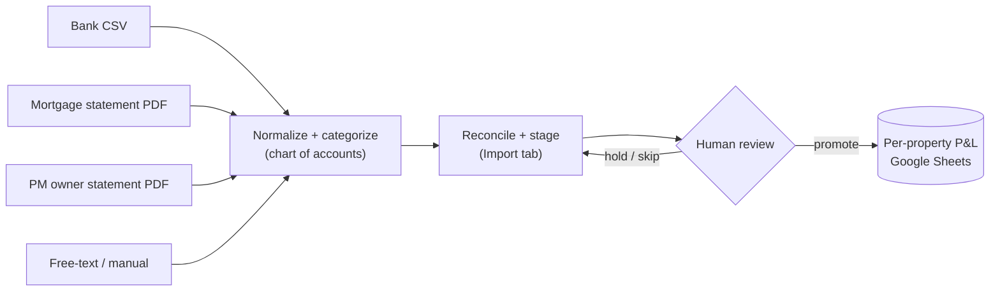

# Rental Portfolio Bookkeeping Agent

An automation system that keeps the books for a multi-property rental portfolio — pulling
income and expenses from every source they scatter across (bank feeds, mortgage statements,
property-manager statements, manual payments), categorizing each transaction against a real
chart of accounts, reconciling it against source documents, and staging it for one-click
review before anything is written to the ledger.

Built to replace the manual, error-prone spreadsheet bookkeeping I was doing across my own
short-term and long-term rentals. *(Property names, account numbers, and figures are
placeholders here; the real values live in a gitignored config.)*

---

## The problem

A small rental portfolio generates a surprising amount of bookkeeping, and none of it lives
in one place:

- **Income and expenses arrive through different channels per property.** A self-managed
  short-term rental nets out through a bank feed. A professionally-managed long-term rental
  runs through the property manager, who collects rent, pays vendors from a reserve, and
  remits the difference. Mortgage interest hides inside a lender's monthly statement. Some
  expenses are paid from a personal card and never touch any business feed at all.
- **Manual entry is slow and quietly wrong.** The failure modes are subtle: routing a
  transaction to the wrong property, double-counting one economic event that shows up on two
  feeds, booking a full mortgage payment as "interest" when most of it is principal, or
  treating an owner's transfer into a reserve as a deductible expense.
- **The stakes are real.** These numbers become a tax return. "Close enough" isn't.

The core insight: **you can't book off raw bank activity.** The same $650 can appear as a
transfer from checking, a deposit to the manager, and a vendor payment — one event, three
ledger lines. Correct books require reasoning about *what actually happened*, not what moved.

## What it does

A pipeline of small, single-purpose input adapters that all normalize to one record shape,
reconcile against the destination ledger, and never write a dollar without human confirmation.



| Source | Adapter | What it contributes |
| --- | --- | --- |
| Bank export (CSV) | `import_relay.py` | Net income + expense drafts; routed to the right property by account number |
| Mortgage statement (PDF) | `mortgage.py` | Splits each payment into interest / escrow / **principal excluded**; disambiguates properties that share a lender by payment amount |
| Property-manager statement (PDF) | `appfolio.py` | Rent + itemized vendor expenses for PM-managed units; reconciles to the statement's own cash-out total |
| Free text / dropped bill | `capture.py` | Off-feed expenses (personal-card, cash) — additive, no double-count |
| Staging → ledger | `promote.py` | Promotes reviewed rows into the month registers; idempotent |
| Monthly status | `inbox_status.py` | Read-only snapshot: what's staged, held, or missing per property |

## Design decisions that make the books *correct*

- **Source-of-truth per property, not one-size-fits-all.** A self-managed unit is booked from
  its bank feed. A PM-managed unit is booked from the *PM's statement* (income and itemized
  expenses), with the bank feed carrying only the mortgage — because the manager's reserve
  funding and remittances are transfers, not P&L events.
- **Transfers are excluded, by classification.** Owner draws, reserve top-ups, and inter-account
  moves are detected and dropped, so one economic event is never counted twice.
- **Reconciliation is built in, not a manual afterthought.** The PM adapter checks its
  classified cash-out against the statement's own total; the bank feed ties to the ledger to
  the penny; mortgage splits are validated against the statement (interest + escrow + principal
  = the drafted amount).
- **Human-in-the-loop on every financial write.** Nothing hits the ledger without a dry-run and
  an explicit confirm. Ambiguous rows (e.g., a security deposit that could be a returnable
  liability *or* forfeited income) are surfaced for a decision rather than guessed.
- **Idempotent staging.** Re-importing a running year-to-date export is safe — already-booked
  rows are recognized and skipped, so re-runs never double-book.
- **A statement only books once its bank draft exists.** A mortgage statement is held until the
  matching bank payment is on record, so the ledger never runs ahead of reality.

## Impact

- **Replaced manual bookkeeping across a 3-property portfolio** with a repeatable pipeline; the
  monthly close is now *drop the files in a folder → one review → done.*
- **Every booked figure reconciles to a source document** — bank feed to the penny, PM
  statement cash-out to the penny, mortgage interest/escrow to the lender's statement.
- **Eliminated the two highest-risk manual errors by construction:** property mis-routing (now
  keyed on account number, so two properties can't cross-contaminate) and double-counting
  (transfers classified out; staging idempotent).
- **Produces a clean, per-property, year-end export** for the CPA instead of a spreadsheet
  reconstruction.

## How it's built

Python, talking to Google Sheets (the ledger the accountant already uses) via `gspread`, a
Google Drive "inbox" folder as the drop point for exports (`google-api-python-client`), and
`PyMuPDF` / `pypdf` for statement parsing. No database, no migration off the tool the human
already trusts — the automation meets the existing workflow where it is.

All property-identifying data (sheet names, account numbers, lenders, PM details) is isolated
in a gitignored `config.py`; the committed code carries none of it. Copy the template to start:

```bash
cp config.example.py config.py     # fill in your properties, accounts, sheet names
pip install -r requirements.txt
python3 inbox_status.py             # read-only: what's staged / missing
python3 import_relay.py             # preview (writes nothing)
python3 import_relay.py --write     # stage to the Import tab
python3 promote.py                  # dry-run plan
python3 promote.py --write          # book it (after review)
```

## Repo layout

```
capture.py         # manual / free-text capture → ledger
import_relay.py    # bank CSV + statement inbox → staging
mortgage.py        # mortgage-statement PDF parser (interest/escrow split)
appfolio.py        # property-manager statement PDF parser
promote.py         # staged rows → month registers (human-confirmed)
inbox_status.py    # monthly read-only status snapshot
config.example.py  # config template (real config.py is gitignored)
private/           # gitignored: credentials, real config, source data
```
